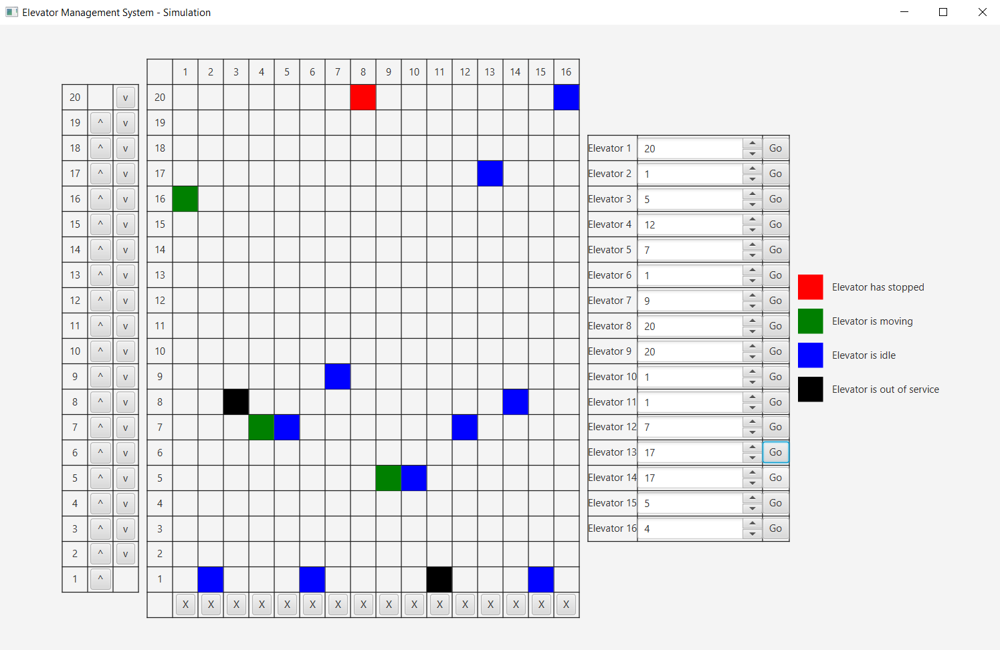
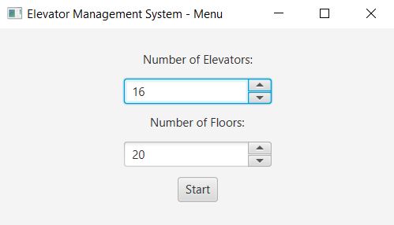
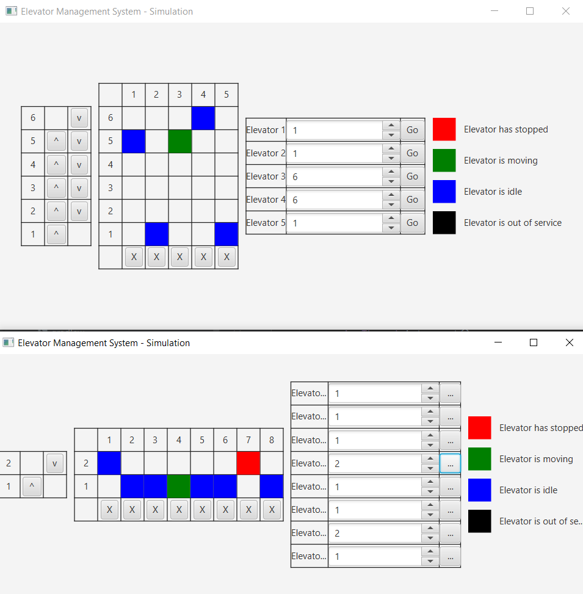
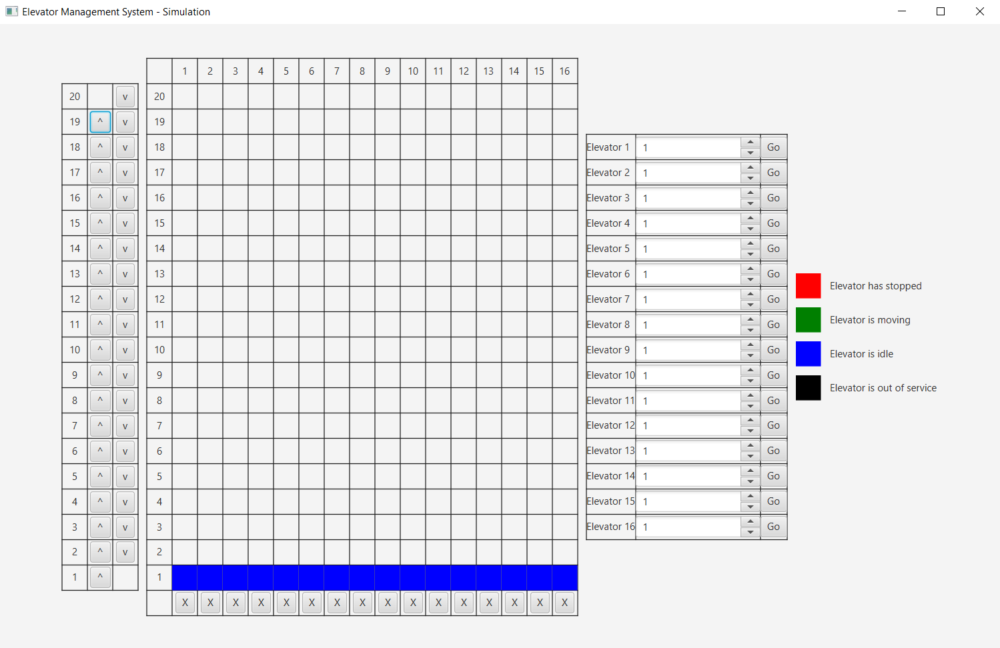
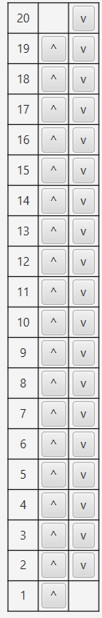
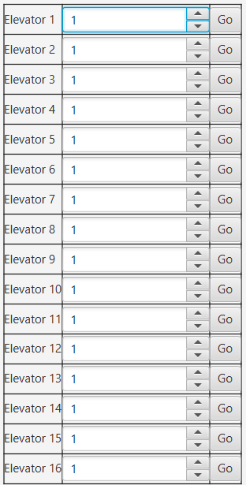
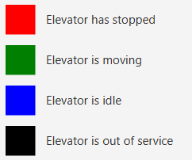

# Elevator_Management_System
> Radosław Rolka

System optymalizujący zarządzanie windami w budynku wraz z wizualizacją działania, umożliwiający użytkownikowi interakcję z systemem.



## Spis treści
1. Wstęp
   1. [Cele projektu](#11-cele-projektu)
   2. [Wymagania](#12-wymagania)
   3. [Uruchomienie](#13-uruchomienie)
2. Instrukcja
   1. [Menu](#21-menu)
   2. [Wizualizacja](#22-wizualizacja)
   3. [Testy](#23-testy)
3. Dokumentacja
   1. [SimulationPresenter](#31-simulationpresenter)
   2. [Engine](#32-engine)
   3. [Scheduler](#33-scheduler)
   4. [ElevatorList](#34-elevatorlist)
   5. [Elevator](#35-elevator)
   6. [Inne](#36-inne)
4. Opis
   1. [Algorytm przydzielania wezwań](#41-algorytm-przydzielania-wezwań)
   2. [Porządkowanie kolejności przystanków](#42-porządkowanie-kolejności-przystanków)

# 1. Wstęp

## 1.1 Cele projektu
Projekt ma na celu stworzenie systemu optymalizującego zarówno czas oczekiwania, jaki i przejazdu wind w budynku.
Ponadto umożliwia użytkownikowi interakcję z systemem poprzez wizualizację działania.

## 1.2. Wymagania
Projekt został stworzony przy użyciu:
- Java 20
- JavaFX 17
- JUnit 5
- Gradle 7.2

## 1.3 Uruchomienie
Aby uruchomić projekt, należy sklonować repozytorium:
```
git clone https://github.com/radoslawrolka/Elevator_Managment_System
```
Następnie przejść do katalogu z projektem:
```
cd Elevator_Managment_System
```
Aby uruchomić aplikację, należy wpisać:
```
gradle run
```
Aby uruchomić testy jednostkowe, należy uruchomić polecenie:
```
gradle test
```

# 2. Instrukcja

## 2.1 Menu
Użytkownik ma możliwość wyboru zarówno liczby pięter w budynku, jak i liczby wind.
Ograniczenia naniesione na te pola to:
- liczba pięter: od 2 do 20
- liczba wind: od 1 do 16



Ponadto możliwe jest jednoczesne uruchomienie wielu niezależnych symulacji.



## 2.2 Wizualizacja
Wizualizacja przedstawia działanie wind w budynku oraz pozwala na interakcję z systemem.



### Przyciski

|                                                                                  Zewnętrzne                                                                                  |                                                          Wewnętrzne                                                           |
|:----------------------------------------------------------------------------------------------------------------------------------------------------------------------------:|:-----------------------------------------------------------------------------------------------------------------------------:|
| Przyciski zewnętrzne symulują zachowanie pasażerów, którzy chcą skorzystać z windy. Oznaczenia przycisków `v` oraz `^` oznaczają odpowiednio planowany kierunek ruchu windy. | Przyciski wewnętrzne mają za zadanie odwzorować klawiaturowe przyciski w windzie, które pozwalają na wybór piętra docelowego. |
|                                                                                                           |                                                                                         |

### Windy
Windy są reprezentowane przez prostokąty, które poruszają się w górę i w dół.
Stan każdej windy jest reprezentowany przez kolor objaśniony w legendzie.
Aby wyłączyć windę należy wcisnąć przycisk oznaczony ```X``` poniżej wybranej windy.



## 2.3 Testy
Testy znajdują się w ```/src/test/java/EMS/System/``` i obejmują podstawową poprawawność działania komponentów.
Sposób uruchomienia został opisany w sekcji [Uruchomienie](#13-uruchomienie).

# 3. Dokumentacja
Projekt składa się z kilku klas, które są odpowiedzialne za różne aspekty symulacji.
Jednakże zostaną opisane tylko te, które są kluczowe dla zrozumienia działania systemu.

## 3.1 SimulationPresenter
Klasa odpowiedzialna za prezentację symulacji, oraz obsługę interakcji z użytkownikiem.
Implementuje interfejs ```ChangeObserver```, który pozwala na reakcję na zmiany w symulacji, pochodzące z silnika symulacji.

## 3.2 Engine
Silnik symulacji, który jest odpowiedzialny za cykl życia symulacji.
Spełnia rolę mediatora pomiędzy symulacją, a prezentacją.
Jest uruchamiany w osobnym wątku, co pozwala na jednoczesne uruchomienie wielu niezależnych symulacji.

## 3.3 Scheduler
Klasa odpowiedzialna za przydzielanie wezwań do wind, przy pomocy metody ```getElevator()``` struktury ```ElevatorList```.

## 3.4 ElevatorList
Struktura danych, która rozszerza klase ```ArrayList<Elevator>```, a jej głównym zadaniem jest dopasowywanie wind do wezwań.
Algorytm przydzielania wezwań jest opisany w sekcji [Algorytm przydzielania wezwań](#41-algorytm-przydzielania-wezwań).

## 3.5 Elevator
Klasa reprezentująca windę, która jest odpowiedzialna za jej ruch w zależności od jej stanu,
oraz obsługę i porządkowanie wezwań, co jest opisane w sekcji [Porządkowanie kolejności przystanków](#42-porządkowanie-kolejności-przystanków).

## 3.6 Inne
- ```Call``` - klasa reprezentująca wezwanie do windy, składające się z numeru piętra oraz kierunku ruchu.
- ```MoveDirection``` - enum reprezentujący kierunek ruchu windy.
- ```ElevatorState``` - enum reprezentujący stan windy.

# 4. Opis

## 4.1 Algorytm przydzielania wezwań
Algorytm przydziela wezwanie do windy na podstawie jej stanu oraz odległości od wezwań.
Pierwszym krokiem jest sprawdzenie, czy winda jest aktywowana, co jest jest warunkiem koniecznym do przyjęcia wezwania.
```
if (elevator.getStatus() != ElevatorStatus.RUNNING) {continue;}
```
Następnie w zależności od kierunku ruchu windy, porównywana jest potencjalna winda z aktualnie przetwarzanym kandydatem.
W algorytmie, dla jak najlepszej opytmalizacji czasu oczekiwania na windę, wybierana jest winda, która jest najbliżej wezwania,
oraz spełnia warunkek dodatkowy, zależny od kierunku ruchu windy.

Dla windy poruszającej się w tym samym kierunku co wezwanie, wybierana jest ta, która jest bliżej wezwania oraz "zachacza" wezwanie.
```
if (elevator.getDirection() == direction) {
   if (isOnWay(elevator, direction, floor) && isCloser(elevator, best, floor)) {
      best = Optional.of(elevator);
   }
}
```
Jeśli winda porusza się w przeciwnym kierunku, to zostanie wybrana, jeśli będzie zaraz zmieniać kierunek ruchu.
```
if (elevator.getDirection() == direction.opposite()) {
   if (isCloser(elevator, best, floor) && elevator.willChangeDirection()) {
      best = Optional.of(elevator);
   }
}
```
Ewentualnie, jeśli winda jest w stanie spoczynku, to zostanie wybrana, jeśli jest bliżej wezwania, niż potencjalnie najlepsza winda.
```
if (elevator.isIdle() && isCloser(elevator, best, floor)) {
   best = Optional.of(elevator);
}
```

## 4.2 Porządkowanie kolejności przystanków
Kolejność przystanków jest porządkowana w zależności od kierunku ruchu windy.
Winda posiada dwie listy:
- ```currentStops``` - przechowuje przystanki, które winda musi odwiedzić w aktualnym kierunku ruchu.
- ```bufferStops``` - przechowuje przystanki, które winda musi odwiedzić po zmianie kierunku ruchu.

A więc jeśli winda zmienia kierunek ruchu, to przystanki z listy ```bufferStops``` są przenoszone do listy ```currentStops```.
```
if (currentStops.isEmpty()) {
   currentStops.addAll(bufferStops);
   bufferStops.clear();
}
```
Algorytm dodawania przystanków liczy odległość pomiędzy przystankiem oraz aktualną pozycją windy i sprawdza, czy przystanek jest na drodze windy.
Ponadto wpływ na dodanie przystanku ma kierunek ruchu, jaki pasażer zamierza obrać.
```
(this.direction.getValue() * (floor - currentFloor) >= 0 ? currentStops : bufferStops).add(floor);
```